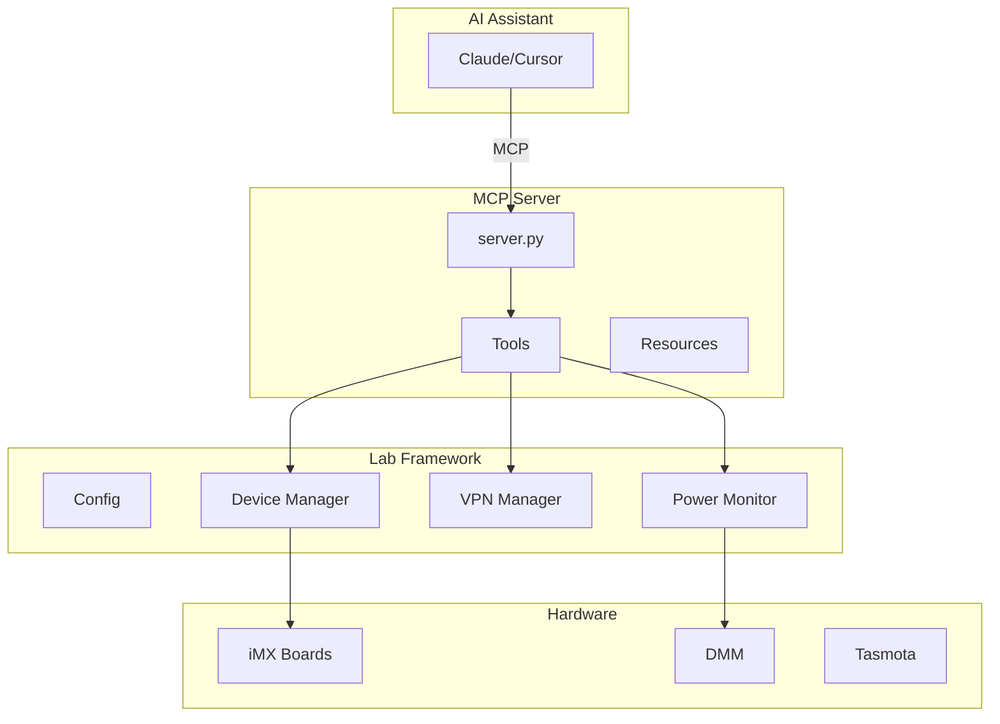

# Lab Testing MCP Server

MCP server exposing remote embedded hardware testing capabilities to AI assistants.

**Version**: 0.1.0

## Quick Start

```bash
pip3 install -r requirements.txt
pip3 install git+https://github.com/modelcontextprotocol/python-sdk.git
python3 test_server.py
```

## Configuration

Add to Cursor MCP config (`~/.cursor/mcp.json`):

```json
{
  "mcpServers": {
    "lab-testing": {
      "command": "python3",
      "args": ["/path/to/mcp-remote-testing/server.py"],
      "env": {"LAB_TESTING_ROOT": "/data_drive/esl/lab-testing"}
    }
  }
}
```

## Architecture



Data flow: AI → MCP Server → Tools → Lab Framework → Hardware

## Tools

- **Device**: `list_devices`, `test_device`, `ssh_to_device`
- **VPN**: `vpn_status`, `connect_vpn`, `disconnect_vpn`
- **Power**: `start_power_monitoring`, `get_power_logs`, `analyze_power_logs`, `monitor_low_power`, `compare_power_profiles`
- **Tasmota**: `tasmota_control`, `list_tasmota_devices`
- **OTA/Containers**: `check_ota_status`, `trigger_ota_update`, `list_containers`, `deploy_container`, `get_system_status`
- **Batch/Regression**: `batch_operation`, `regression_test`, `get_device_groups`
- **Help**: `help` - Get usage documentation and examples

## Resources

- `device://inventory` - Device inventory
- `network://status` - Network/VPN status
- `config://lab_devices` - Raw config
- `help://usage` - Help documentation and usage examples

## Development

```bash
pip3 install -e ".[dev]"
pre-commit install
black . && ruff check . --fix
```

**Adding tools**: Create function in `tools/`, register in `server.py` (`handle_list_tools`, `handle_call_tool`).

**Versioning**: Semantic versioning (MAJOR.MINOR.PATCH). Update `version.py`, see [CHANGELOG.md](CHANGELOG.md).

## Documentation

- [API Reference](docs/API.md) - Tool and resource API
- [Setup Guide](docs/SETUP.md) - Installation and configuration
- [Architecture Diagram](docs/architecture.mmd) - Full system diagram

## License

GPL-3.0-or-later - Copyright (C) 2025 Dynamic Devices Ltd

See [LICENSE](LICENSE) for full license text.

## Maintainer

Alex J Lennon <ajlennon@dynamicdevices.co.uk>
